# Features

OpenCorpoChat is team chat for organizations of up to about 200 people. It runs as a single process that you host yourself. Everything below is included: there is no paid tier and no "enterprise edition".

This page covers the five features teams rely on most, then lists every feature with its status, and ends with what we deliberately don't build.

- [1. Messaging & threads](#1-messaging--threads)
- [2. Voice, video & screen sharing](#2-voice-video--screen-sharing)
- [3. Search](#3-search)
- [4. Integrations: bots, webhooks, slash commands & API](#4-integrations-bots-webhooks-slash-commands--api)
- [5. Administration, security & compliance](#5-administration-security--compliance)
- [Full feature matrix](#full-feature-matrix)
- [What we deliberately don't do](#what-we-deliberately-dont-do)

> The screenshots show the built-in demo company. Run `ocpc seed-demo` on an empty instance to explore it yourself; see [Getting started](getting-started.md#a-try-it-locally-in-60-seconds).

---

## 1. Messaging & threads

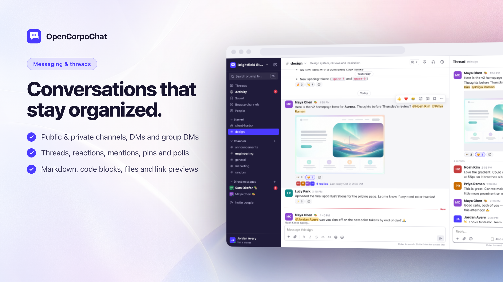

**What it does**

- **Conversations:** public channels, private channels, direct messages and group DMs (up to 9 people). Announcement channels let only admins post, while everyone can still reply in threads.
- **Threads** keep side discussions out of the main channel. "Also send to channel" shares an important reply with everyone.
- **Rich messages:** Markdown, syntax-highlighted code blocks, @mentions (including `@here`, `@channel` and user groups such as `@design`), #channel links, emoji shortcodes, custom emoji, reactions, edits, deletes, pins, saved items, polls, forwarding, and link previews fetched by the server.
- **Getting work done:** scheduled messages, reminders, per-conversation drafts, typing indicators, unread markers, "mark unread", and a Threads view showing every conversation you follow.

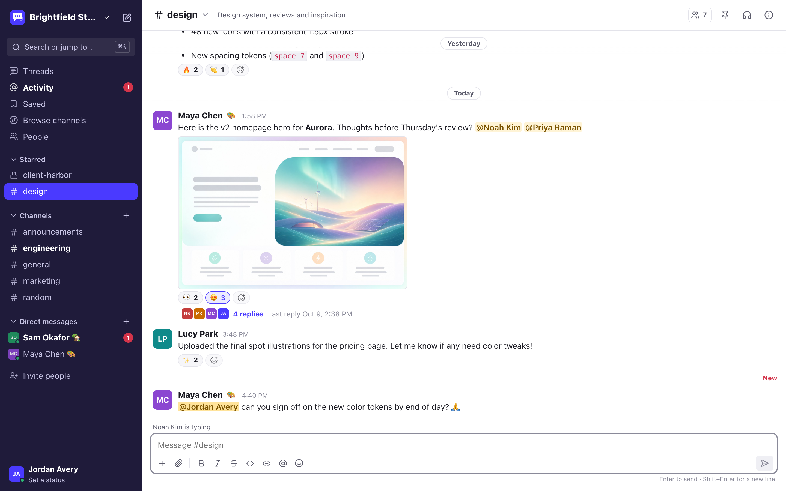
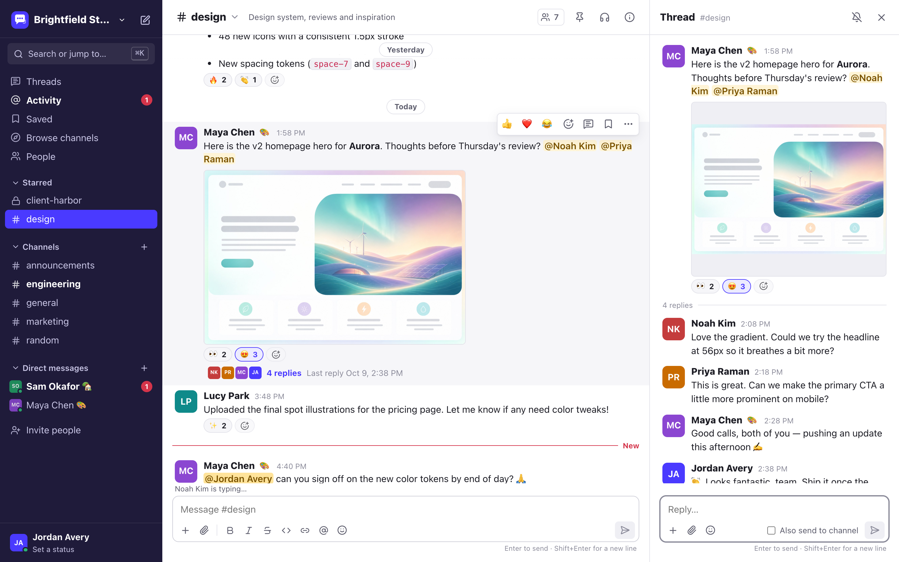

**Why it matters for a small org.** Most of a team's day happens here. Threads and announcement channels keep busy channels readable. Custom sidebar sections, starring and muting let each person decide what deserves their attention.

**Under the hood**

| Piece                                                                 | Where                                                                          |
| --------------------------------------------------------------------- | ------------------------------------------------------------------------------ |
| Message model, mentions, threads, edits and deletes                   | `apps/server/src/modules/messages/service.ts`                                  |
| REST endpoints (list, post, react, pin, save, poll, forward, threads) | `apps/server/src/modules/messages/routes.ts`                                   |
| Unread and mention counts, membership                                 | `apps/server/src/modules/channels/service.ts`                                  |
| Mention, emoji and search parsing shared by client and server         | `packages/shared/src/{mentions,emoji,search}.ts`                               |
| Live updates                                                          | `apps/server/src/realtime/hub.ts` → `apps/web/src/lib/store.ts` (`applyEvent`) |
| Message rendering (sanitized Markdown)                                | `apps/web/src/lib/markdown.ts`, `apps/web/src/components/Message.tsx`          |
| Composer (autocomplete, uploads, slash commands, drafts)              | `apps/web/src/components/Composer.tsx`                                         |

---

## 2. Voice, video & screen sharing

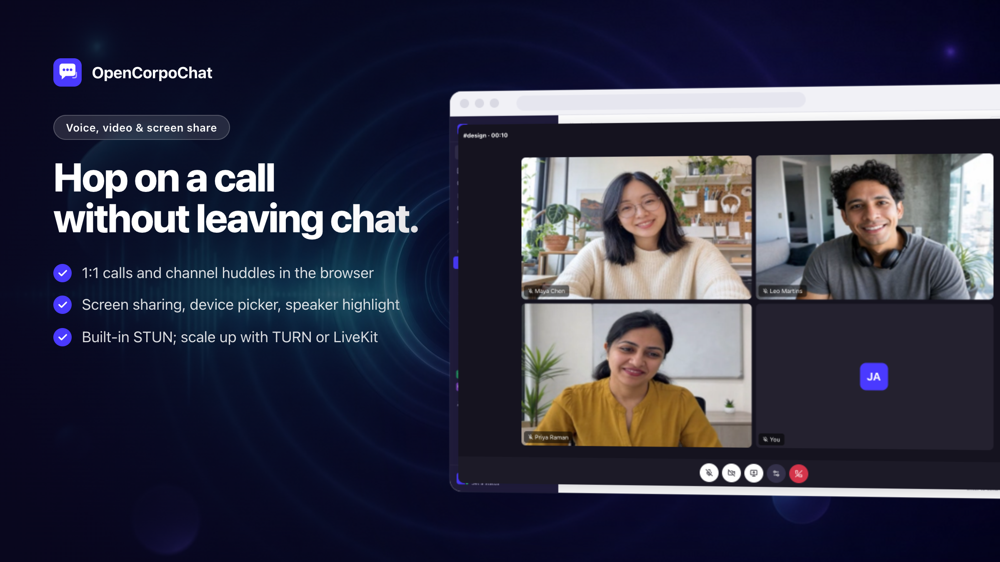

**What it does**

- **Calls:** one-click 1:1 calls from a DM, and "huddles" in any channel for small groups.
- **Media:** camera, screen sharing, and microphone, camera and speaker selection. Active speakers are highlighted.
- **Incoming calls** ring with a prompt, a sound and a desktop notification.
- **Call diagnostics** test your microphone and camera, and show whether direct (STUN) and relayed (TURN) connections work.
- **Larger meetings:** optionally route calls through a self-hosted LiveKit server. The interface stays the same.

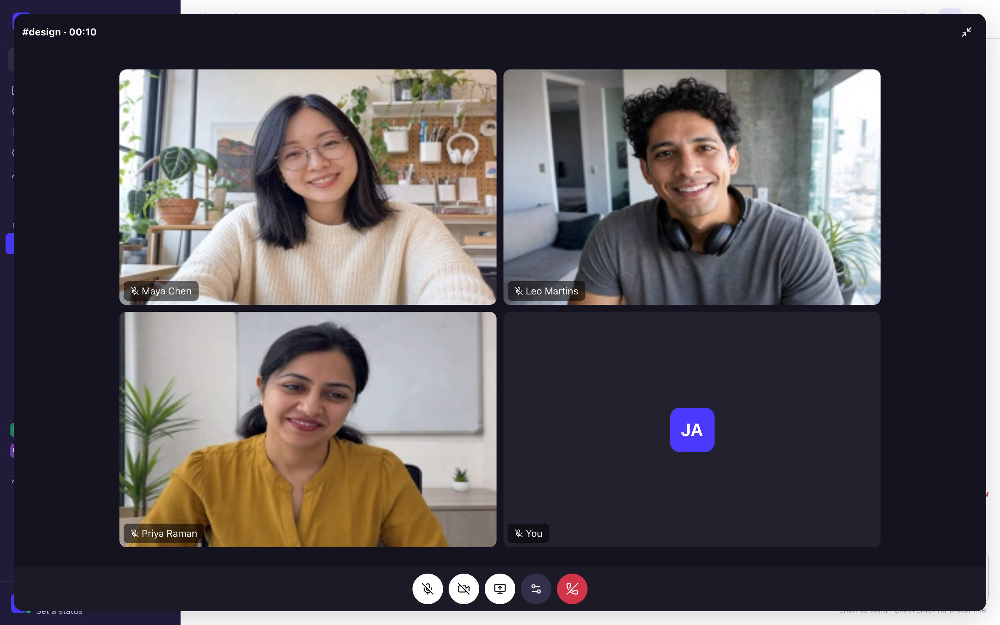

**Why it matters.** Most teams pay for a separate meeting tool on top of chat. For quick conversations and small meetings, built-in calls are enough, and audio and video go directly between browsers whenever possible.

**Under the hood**

- **Peer-to-peer mesh by default** (up to 8 people per call). Browsers connect to each other directly using WebRTC, and the server only relays signaling over the existing WebSocket. See `apps/web/src/calls/mesh.ts` and `apps/server/src/modules/calls/routes.ts`.
- **Built-in STUN server** on UDP 3478 (`apps/server/src/realtime/stun.ts`). Calls work across most home and office networks without any third-party service.
- **TURN** for strict networks. The server issues short-lived credentials using the standard TURN REST scheme, so coturn works out of the box. See [admin guide §11](admin-guide.md#11-calls-stun-turn-and-livekit).
- **LiveKit mode** (`apps/web/src/calls/livekit.ts`) loads only when `LIVEKIT_URL` is configured.
- **Troubleshooting:** run `ocpcCallDebug()` in the browser console during a call to see each peer's ICE state and candidates.

---

## 3. Search

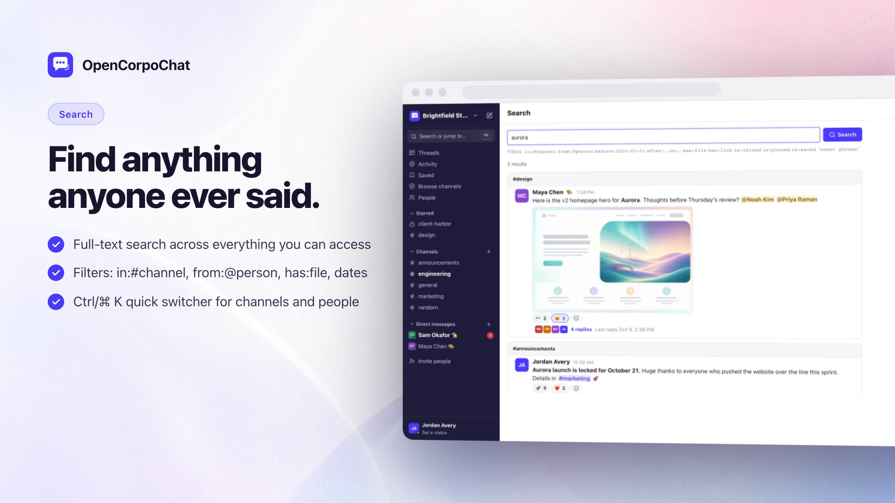

**What it does**

- **Full-text search** across every message you're allowed to see, with filters:

  | Filter       | Example                                                  |
  | ------------ | -------------------------------------------------------- |
  | Channel      | `in:#design`                                             |
  | Person       | `from:@sam`                                              |
  | Date         | `before:2026-01-31`, `after:2026-01-01`, `on:2026-03-14` |
  | Content      | `has:file`, `has:link`, `has:reaction`                   |
  | Type         | `is:thread`, `is:pinned`, `is:saved`                     |
  | Exact phrase | `"quarterly plan"`                                       |

- **Quick switcher** (Ctrl/⌘ + K) jumps to any channel, DM or person. Unread and recent conversations come first.
- **File search** finds files by name.

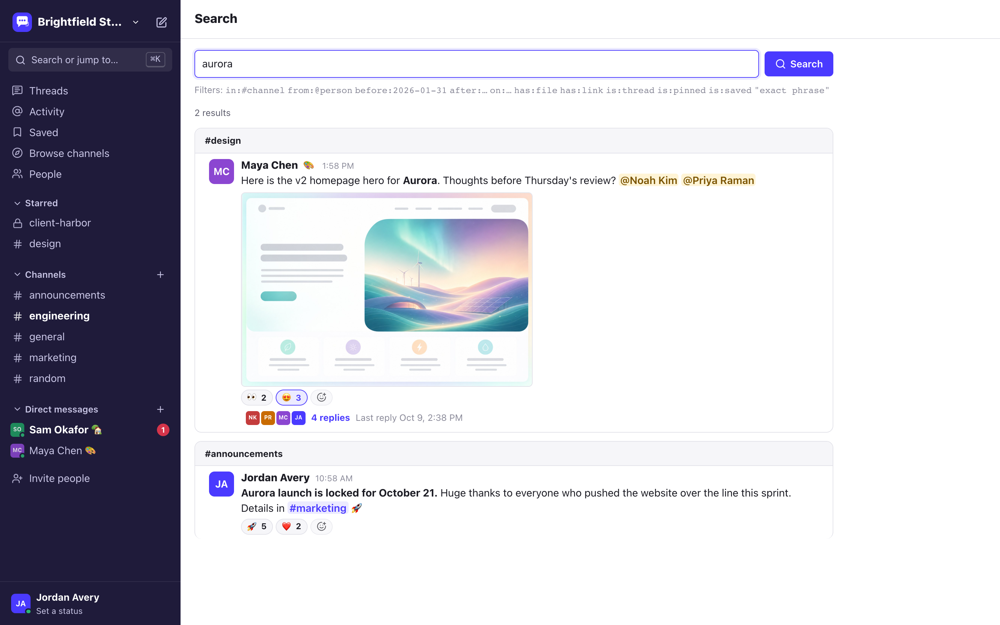

**Why it matters.** Chat only works as company memory if you can find things again. Your full history is searchable, with no message limit and no paywall.

**Under the hood.** SQLite uses an FTS5 index kept in sync by triggers. PostgreSQL uses a generated `tsvector` column with a GIN index. Both support prefix matching, so you can search as you type. Results are always restricted to channels the searcher can read; guests only search their own channels. See `apps/server/src/modules/search/routes.ts` and the query parser in `packages/shared/src/search.ts`.

---

## 4. Integrations: bots, webhooks, slash commands & API

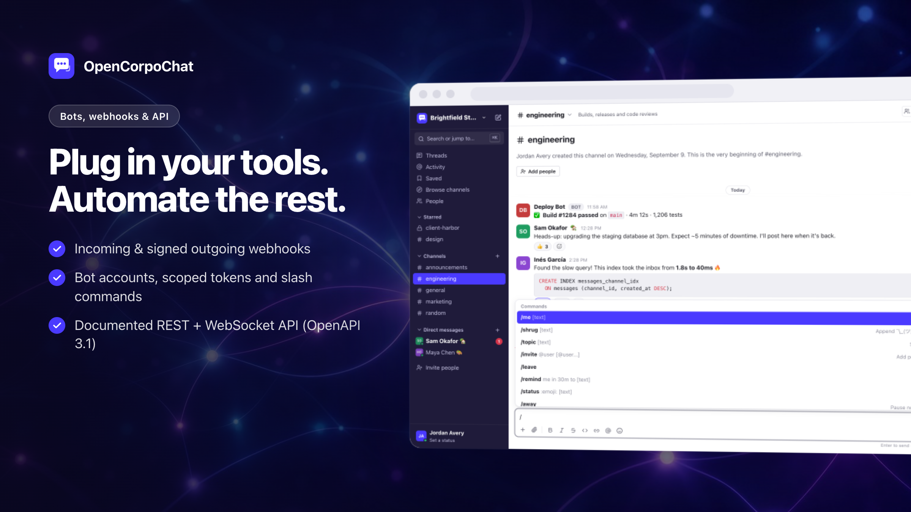

**What it does**

- **Incoming webhooks:** any tool can post into a channel with a single `curl`. It accepts the widely used `{"text": "..."}` payload shape.
- **Outgoing webhooks:** messages in a channel are POSTed, HMAC-signed, to your service, which can reply.
- **Custom slash commands:** for example `/deploy staging`, backed by your own HTTP endpoint. Built-in commands include `/remind`, `/status`, `/dnd`, `/invite`, `/topic`, `/call`, `/msg`, `/me` and `/shrug`.
- **Bot accounts and personal API tokens** with `read`, `write` and `admin` scopes.
- **Full REST API.** The web app uses only the public API, so anything you can click, a script can do. Every instance publishes an OpenAPI 3.1 spec at `/api/v1/openapi.json`.
- **Realtime WebSocket API** for bots that react to events.

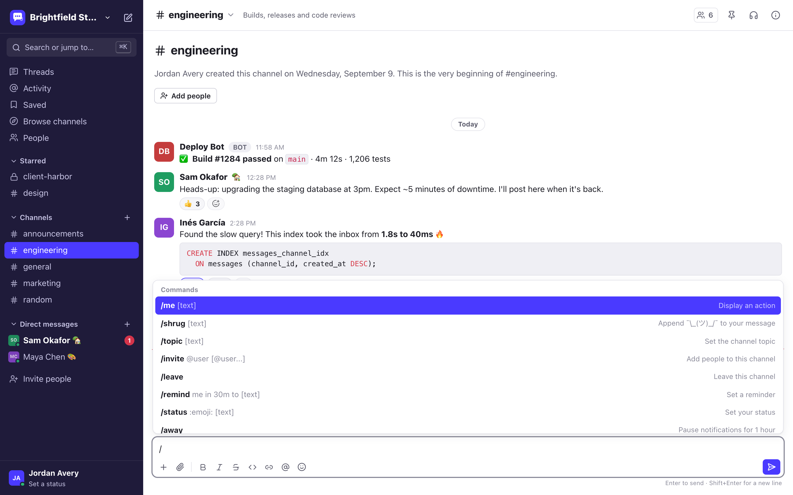

**Why it matters.** Small teams live on automation: CI results, uptime alerts, form submissions, deploys. Webhooks and bots bring those into the conversation without per-integration fees or marketplace approval.

**Under the hood**

| Piece                                                                         | Where                                                                                                          |
| ----------------------------------------------------------------------------- | -------------------------------------------------------------------------------------------------------------- |
| Tokens, bots, incoming and outgoing webhooks                                  | `apps/server/src/modules/integrations/routes.ts`                                                               |
| Slash commands                                                                | `apps/server/src/modules/integrations/slash.ts`                                                                |
| One `route()` helper adds auth, validation and OpenAPI docs to every endpoint | `apps/server/src/lib/route.ts`, `apps/server/src/openapi.ts`                                                   |
| Recipes                                                                       | [Integrations cookbook](integrations.md)                                                                       |
| Examples                                                                      | [`examples/bot.mjs`](../examples/bot.mjs), [`examples/webhook-receiver.mjs`](../examples/webhook-receiver.mjs) |

---

## 5. Administration, security & compliance

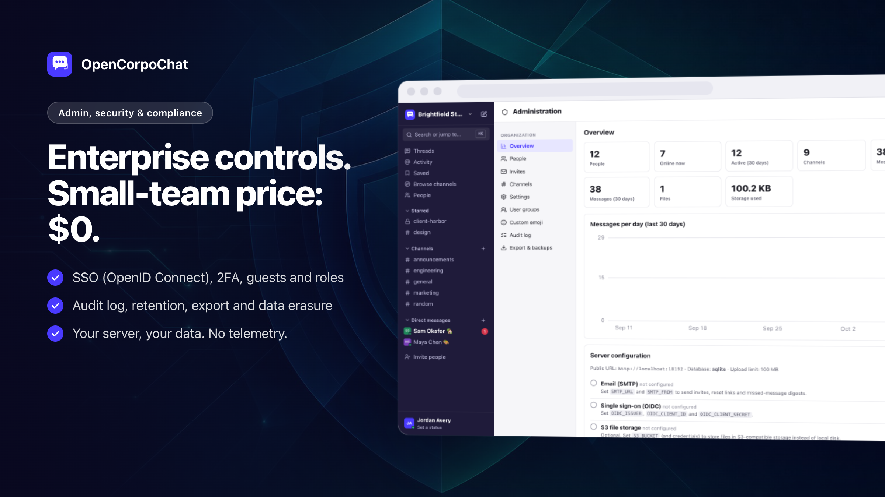

**What it does**

- **Identity**
  - Invite links, which can be restricted by email, expiry or number of uses.
  - Email-domain restrictions on sign-up.
  - Guest accounts that see only the channels you choose.
  - OpenID Connect single sign-on (Google Workspace, Microsoft Entra ID, Okta, Keycloak, Authentik…), with an optional "SSO only" mode.
- **Account security**
  - TOTP two-factor authentication with recovery codes, which can be required for the whole organization.
  - Session list with remote sign-out.
  - Admin-issued password reset links.
- **Admin console**
  - Usage statistics, computed locally.
  - People and roles (owner, admin, member, guest), invites, all channels, and org settings.
  - User groups, custom emoji, and a full audit log.
- **Compliance**
  - Retention policies, org-wide or per channel.
  - Per-person data export and erasure for data-subject requests.
  - Full organization export in a [documented format](export-format.md).
  - Import from Slack-format export archives.
  - Backup and restore from the CLI.

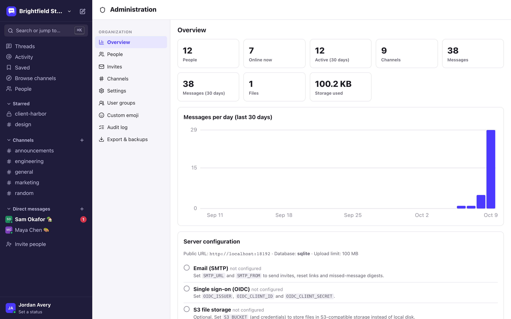
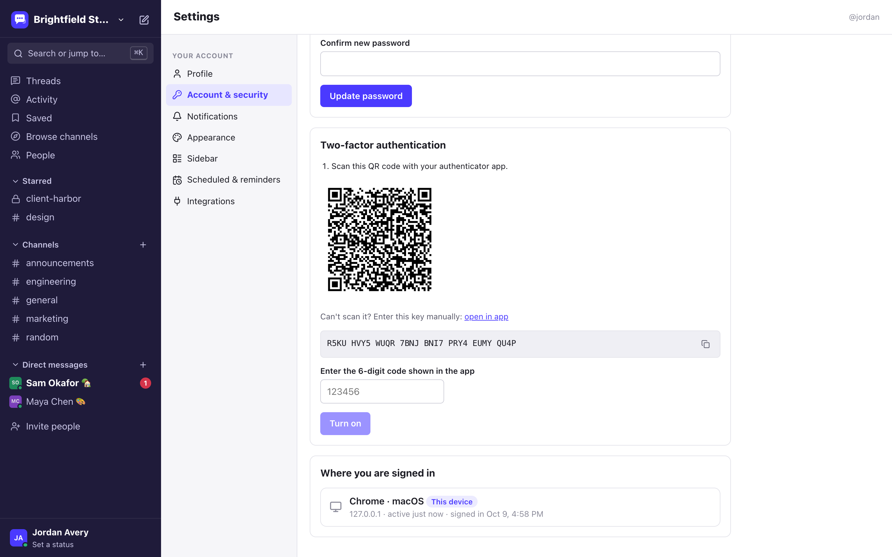

**Why it matters.** Small organizations still need offboarding, audits and data-protection requests, usually without a dedicated IT team. Hosted tools often put these behind their top pricing tier; here they're part of the product.

**Under the hood**

- **Authorization rules** live in one pure, unit-tested module (`packages/shared/src/permissions.ts`), and the server enforces them on every request.
- **Passwords** are hashed with scrypt. API tokens and invite codes are stored only as SHA-256 hashes.
- **Cookie sessions** require a CSRF header on writes. The server sets a strict Content Security Policy and rate-limits authentication endpoints.
- **Code locations:** admin endpoints are in `apps/server/src/modules/admin/routes.ts`, the audit log in `apps/server/src/modules/admin/audit.ts`, and the OIDC flow in `apps/server/src/modules/auth/oidc.ts`.
- **No telemetry.** The server makes outbound calls only to services you configure: SMTP, OIDC, S3, link previews and push.

---

## More screenshots

|                                                                               |                                                     |
| ----------------------------------------------------------------------------- | --------------------------------------------------- |
| 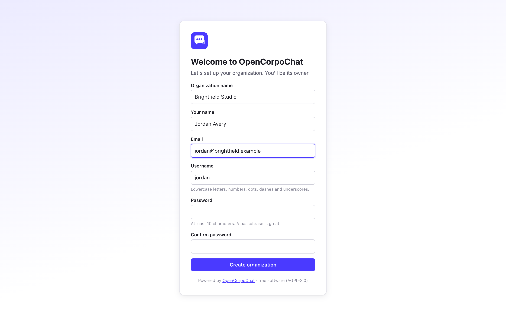 First-run setup wizard       | 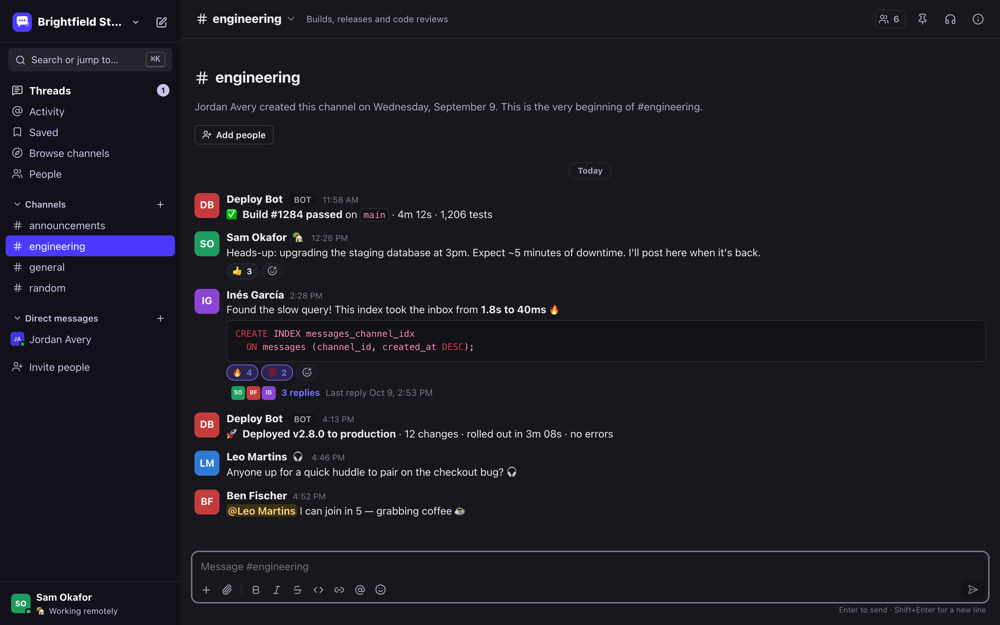 Dark mode |
| 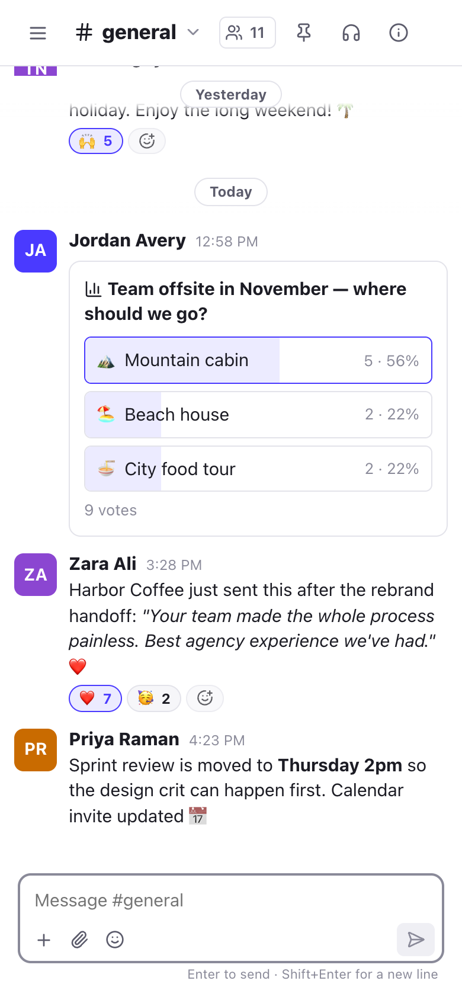 Phone-sized layout (installable PWA) |                                                     |

---

## Full feature matrix

✅ shipped · 🔶 partial · 🔜 planned

### Workspace & identity

| Feature                                                                                  | Status |
| ---------------------------------------------------------------------------------------- | ------ |
| Single organization per instance, first-run setup wizard                                 | ✅     |
| Email + password accounts, password policy                                               | ✅     |
| Invite links (expiry, max uses, email-bound) and email invites (when SMTP is configured) | ✅     |
| Roles: owner, admin, member, guest; bot accounts                                         | ✅     |
| Profiles: name, title, pronouns, avatar, time zone, phone                                | ✅     |
| Custom status with expiry; Do Not Disturb                                                | ✅     |
| TOTP 2FA with recovery codes; can be required org-wide                                   | ✅     |
| OpenID Connect SSO; SSO-only mode                                                        | ✅     |
| Session list and revoke                                                                  | ✅     |
| Deactivate users; erase users                                                            | ✅     |
| User groups (`@handle` mentions)                                                         | ✅     |
| SCIM provisioning                                                                        | 🔜     |
| LDAP authentication                                                                      | 🔜     |

### Conversations

| Feature                                         | Status |
| ----------------------------------------------- | ------ |
| Public and private channels, DMs, group DMs     | ✅     |
| Topic, description, archive / unarchive, rename | ✅     |
| Channel admins                                  | ✅     |
| Announcement (read-only) channels               | ✅     |
| Default channels for new members                | ✅     |
| Channel directory and browser                   | ✅     |
| Mute; per-channel notification level; starring  | ✅     |
| Custom sidebar sections                         | ✅     |
| Shared channels between instances (federation)  | 🔜     |

### Messaging

| Feature                                                                       | Status |
| ----------------------------------------------------------------------------- | ------ |
| Realtime delivery with optimistic sending and retry                           | ✅     |
| Markdown and syntax-highlighted code                                          | ✅     |
| Threads, "also send to channel", follow / unfollow                            | ✅     |
| Reactions, custom emoji                                                       | ✅     |
| @user, @here, @channel, @group mentions; #channel links                       | ✅     |
| Edit (optional edit window) and delete                                        | ✅     |
| Pins, saved items                                                             | ✅     |
| Unread tracking, "mark unread", jump to unread                                | ✅     |
| Typing indicators                                                             | ✅     |
| Link previews (server-side, SSRF-protected)                                   | ✅     |
| Scheduled messages, reminders                                                 | ✅     |
| Forwarding, polls                                                             | ✅     |
| Drafts (saved per conversation in the browser; not yet synced across devices) | 🔶     |
| Read receipts                                                                 | 🔜     |

### Files

| Feature                                               | Status |
| ----------------------------------------------------- | ------ |
| Upload by button, drag-and-drop or paste              | ✅     |
| Inline images, video, audio; PDFs open in the browser | ✅     |
| Local disk or S3-compatible storage                   | ✅     |
| Size limit and allowed file types                     | ✅     |
| Files list per channel, file name search              | ✅     |
| Server-generated thumbnails                           | 🔜     |
| Virus scanning hook                                   | 🔜     |

### Search

| Feature                       | Status |
| ----------------------------- | ------ |
| Full-text search with filters | ✅     |
| Quick switcher                | ✅     |

### Notifications & presence

| Feature                                        | Status |
| ---------------------------------------------- | ------ |
| Presence (online, away, offline, DND)          | ✅     |
| Badges, activity feed, tab title and app badge | ✅     |
| Desktop notifications and Web Push             | ✅     |
| Email digests of missed mentions and DMs       | ✅     |
| Keyword notifications; working-hours schedule  | ✅     |

### Calls

| Feature                                              | Status |
| ---------------------------------------------------- | ------ |
| 1:1 calls and channel huddles (mesh, up to 8 people) | ✅     |
| Screen sharing, device selection, active speaker     | ✅     |
| Built-in STUN; TURN support; call diagnostics        | ✅     |
| LiveKit SFU for larger calls                         | ✅     |
| Ringing for DM calls                                 | ✅     |
| Recording                                            | 🔜     |

### Integrations

| Feature                                           | Status |
| ------------------------------------------------- | ------ |
| REST API with OpenAPI 3.1; realtime WebSocket API | ✅     |
| Personal tokens and bot tokens with scopes        | ✅     |
| Incoming and outgoing webhooks (HMAC-signed)      | ✅     |
| Built-in and custom slash commands                | ✅     |
| Interactive message buttons                       | 🔜     |
| Server-side plugin API                            | 🔜     |

### Administration & compliance

| Feature                                                            | Status |
| ------------------------------------------------------------------ | ------ |
| Admin console (people, invites, channels, settings, groups, emoji) | ✅     |
| Audit log                                                          | ✅     |
| Retention policies (org-wide; per channel in the data model)       | ✅     |
| Organization export (NDJSON); per-person export and erasure        | ✅     |
| Import from Slack-format export archives (CLI)                     | ✅     |
| Local usage statistics                                             | ✅     |
| Backup and restore CLI (SQLite; use `pg_dump` for Postgres)        | ✅     |
| Legal hold                                                         | 🔜     |
| Prometheus metrics endpoint                                        | 🔜     |

### Clients

| Feature                                                     | Status |
| ----------------------------------------------------------- | ------ |
| Responsive web app; installable PWA (desktop, Android, iOS) | ✅     |
| Light, dark and system themes; compact density              | ✅     |
| Keyboard shortcuts (press `?`)                              | ✅     |
| Translation framework (English shipped)                     | ✅     |
| Native desktop wrapper                                      | 🔜     |
| Native mobile apps                                          | 🔜     |

---

## What we deliberately don't do

- **Multi-tenant hosting.** Each instance serves one organization. Running one instance per organization is simpler and safer.
- **Built-in AI features.** Nothing ships that sends your messages to an external AI service. You can connect any bot you like through the API.
- **End-to-end encryption (for now).** Messages are protected in transit by TLS and at rest by your server's disk encryption. E2EE is on the long-term roadmap, but it conflicts with server-side search and compliance export, so we won't rush it.
- **Docs, wiki, tasks and calendar.** Integrate the tools you already use instead.
- **Telemetry.** The project never phones home. Statistics in the admin console are computed on your server and stay there.
- **Copying anyone's product.** The interface uses long-standing, generic chat conventions with original design, icons and sounds. Other products' trademarks appear only to describe compatibility, such as importing a Slack-format export.
